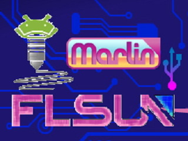
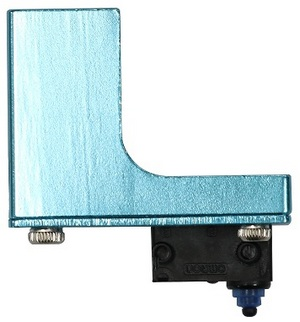
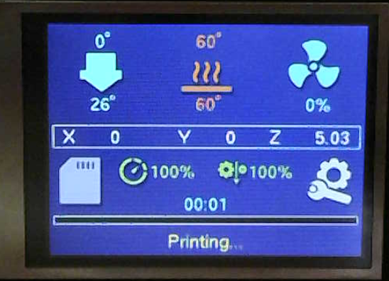
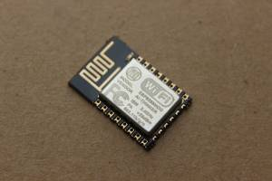
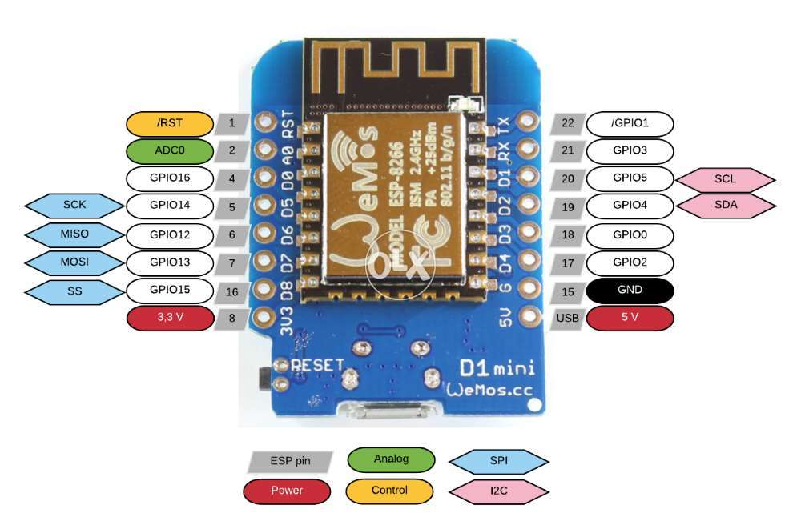
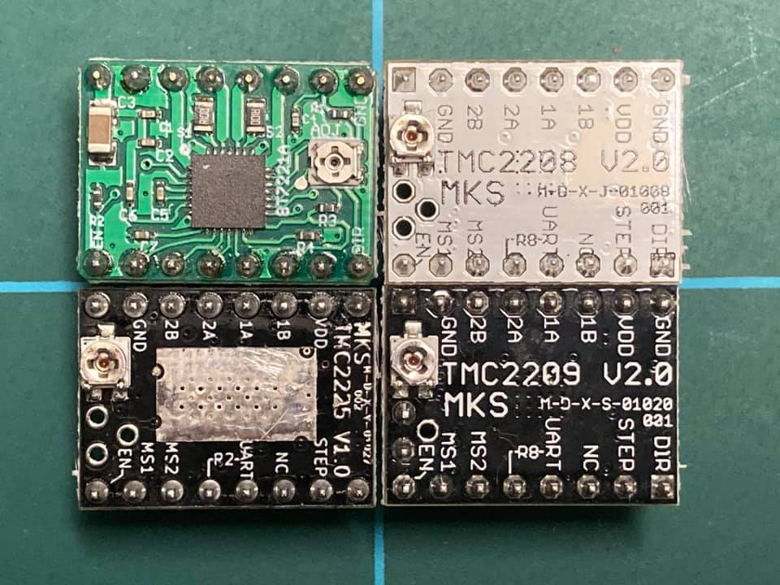
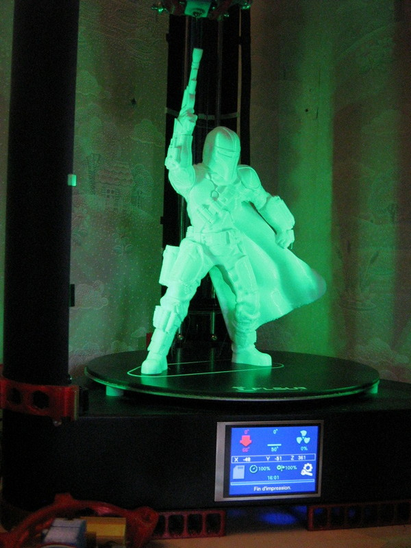
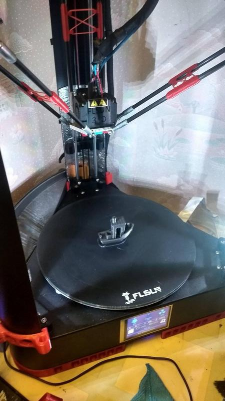
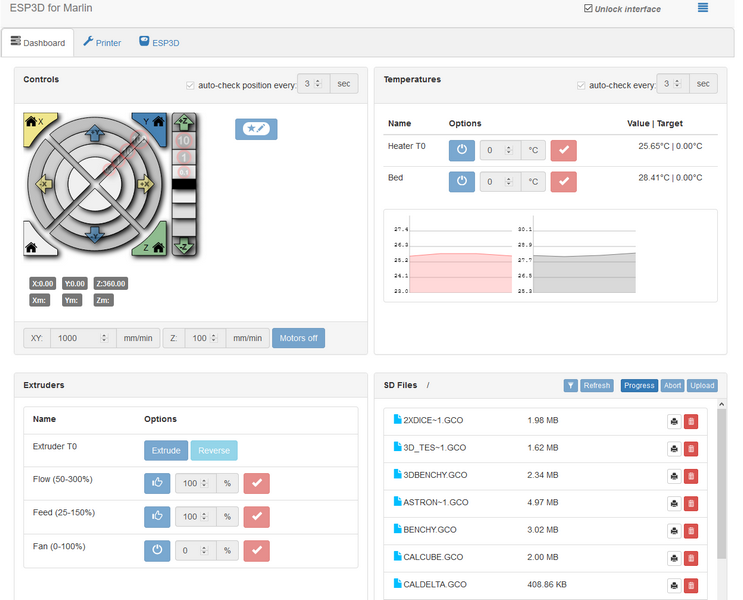

# Marlin 3D Printer Firmware for Delta QQS-Pro with HISPEEDv1 Board.

[**Group FaceBook**](https://www.facebook.com/groups/120961628750040)

[**My Posts on Group FB**](https://www.facebook.com/groups/120961628750040/user/100000652030417)

__Not for production use. Use with caution!__

## Marlin 2.0 Bugfix Branch
 Update Marlin-BugFix 20201118
  - **News Firmwares with optimisation moves/accel printing, Calibration UBL, Standard Home, etc**
  - Validate TMC2209 modes.
  - Validate Module Wifi ESP8266/ESP12 [Firmware ESP3Dv2](https://github.com/luc-github/ESP3D/wiki/Install-Instructions)

  ## Validate:

  - Firmware for QQS-Pro with A4988/TMC220x_Standalone/TMC220x_UART/TMC2209_UART one-wire

With activate parts:

* [PID_EDIT_MENU]
* [DELTA_CALIBRATION_MENU]
* [POWER_LOSS_RECOVERY]
* [FILAMENT_RUNOUT_SENSOR]
* [AUTO_BED_LEVELING_UBL]
* [PAUSE_BEFORE_DEPLOY_STOW]
* [LIN_ADVANCE]
* [ARC_SUPPORT]

Typically the probe for the QQS-Pro printers.

  * Z Probe Offset of -16.2mm

    
  
  * TFT screen color Marlin

    

Optionals:

  * Modules Wifi
  
    
    

  * Micro Steppinp Drivers
  
    

  * Led Strip with additional converter 24v/12-5v
  
    

No validate:
-TMC51

  ## Exemple: 

8CWBL-Robin_mini.bin =>  (8)TMC2208 standalone - (C)UI Marlin - (W)Module Wifi - (B)Extruder BMG - (L)LinearAdvance  

**Note**: After choosing your binary, remove the "8CWBL-" header or rename the file to "Robin_mini.bin", place it on your SD card, insert your SD card into the printer and power on your printer.

Caption:

  ### /*------Drivers--------*/
  - (S) A4988 (green/red)
  - (8) TMC2208 Standalone
  - (9) TMC2209 Standalone
  - (U8) TMC2208_UART with no module ESP12.
  - (U9) TMC2209_UART with no module ESP12.
  - **(UH) TMC2209_UART with one wire (option modules Wifi/Neopixel)**
  - (U8+) TMC2208 (XYZ) + Choice for E0 (A4988,TMC220x) 
  - (U9+) TMC2209 (XYZ) + Choice for E0 (A4988,TMC220x)
  ### /*------Modules--------*/
  - (W) Module ESP8266/ESP12
  - (T) Extruder Titan
  - (B) Extruder BMG
  - (N) NeoPixel
  ### /*-------Options UI TFT--------*/
  - (F) UI STANDARD 
  - (C) UI MARLIN 
  - (I) UI MKS
  ### /*-------Others options in firmware----*/ 
  - (A) BED_LEVELING_BILINEAR
  - (U) BED_LEVELING_UBL
  - (R) ARC_SUPPORT
  - (L) Linear Advance (Possible Bug with BabyStep and TMC)

  ## HELP - PROCEDURE - TIPS 
  After the flash, you must reset your printer using the menu or M502,
  M500 put the probe then start a calibration or G33 V3 (5/8 iterations).
    
    **Tip**: After a Delta calibration (G33 v3) if you get a "std dev:" sup.> 0.2, 
             it means that you have a problem with the structure of your printer!
             A "std dev:" of 0.04 and less is excellent !!
  
  Remove the probe and then redo the Z offset by deactivating the endstops by menu or "M211 S0".
  Then lower the nozzle slowly to adjust to a sheet of paper.
  View the value on the display and enter the value in the Probe_Z_Offset menu Configuration or M851 Z-xx.xx and finally store the parameters (M500).
  Through a terminal (I do it through the web page of the Wifi module),

  Perform a bed calibration (UBL) with this commands:
  - M190 S60 (temp bed at 60° or other)
  - G28 (autohome)
  - G29 P1 (automated probing of the bed)
  - G29 P3 T (Repeat until all mesh points are filled in)
  - G29 P3 T (bis)
  - G29 T (View the Z compensation values)
  - G29 S1 (Save UBL mesh points to EEPROM)
  - G29 F 5 (Set Fade Height for correction at 5 mm)
  - G29 A (Activate the UBL System)
  - M500 (Save to EEPROM)
  - M140 S0 (Stop temp bed)

  Remember to adjust your temperatures by doing your **bed PID** and adjust your **eSteps** for stable filament flow.

  **TIPS-SLICER** 
  In your Start GCode on your Slicer.
  - M420 S1 enable bed leveling
  - M420 Lx (Load mesh_x correction)
  And on my EndGCode I remove G28 and I substitute with this type of code:
  "{if layer_z <max_print_height} G1 Z {min (layer_z + 100, max_print_height)} {endif} F4000" 
  This works fine in PrusaSlicer (https://help .prusa3d.com/en/article/macros_1775).
  Go 100cm above the finished object.It's up to you to adapt it for your favorite Slicer or to improve mine.

  **You will find some Slicer profiles in the "Slicers" directory.(in progresss...)** 

  # For the Wifi Module (ESP3DV2 directory):

Put the firmware (MksWifi.bin) on the scard with the firmware FLSUN (Robin_mini.bin)
1) Flash original firmware + original mkswifi 
2) Flash original firmware + Custum mkswifi 
3) Inspect the Wifi Access Point and if you see: AP-FLSUN => Flash ok 
4) Flash Marlin 
to run the update of Mks_Wifi or You also can do by web page of the AP (192.168.4.1).

 ### Initial Configuration after the flash.
1. Open device web page on the AP connected device
Accept Captive portal redirect or
2 Open a web browser and navigate to http://192.168.4.1
3. Upload 2 files in the "zip' and configure the device to your choosing
4. I recommend changing to Station mode and connecting to your home/office Wifi instead of staying in AP mode
5 You may want to change the Baud rate
6. You can change to DHCP, or at the very least setup a Static IP you are familiar with.

More information: [ESP3Dv2.1](https://github.com/luc-github/ESP3D/wiki/Install-Instructions)

Once reconnected to the module's web page, you must load the two files "index.html.gz"
and "preferences.json" to have the user interface.

Enjoy....🙃

 ## Support my work

  This QQS-Pro porting project for the Marlin firmware was only possible thanks to its supporters, you can participate via
   
   
   
  You can also send me a tip via [Thingiverse](https://www.thingiverse.com/FamStel/about) if you prefer.

 Massive thank you in advance :heart:

# Version history
## Marlin 2.0 Bugfix Branch 
Update Marlin-BugFix 20201030
  - Last correction for Black screen in UI Color
  - Correction thermal protection hysterisis.
  - Enable mode TMC220x UART SoftSerial
  - Add comments into definition_pins file.

 Update Marlin-BugFix 20201022
  - Integration in the Marlin firmware of the HISPEED motherboard and configuration files for the QQS-Pro.
  - Fixed Deploy/Stow ZProbe
  - Fixed for users using E3Dv6 hotend
  - Others TIPS(QQS_Config.h, Quick calibration 6, Menu management of NeoPixel leds, etc).

## Marlin 2.0.7 
 Update 2020-10-01
 
## Marlin 2.0 Bugfix Branch
 Update Marlin-BugFix 20200905

